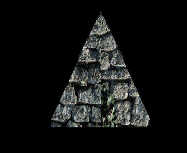

_Thibaut Castanié - M2 IMAGINA_

# Compte rendu du TP5 de Moteur de Jeux

L'objet a été texturé en utilisant un **shader**.

    static const char *vertexShaderSource =
        "varying vec4 pos;\n"
        "varying lowp vec4 col;\n"
        "uniform highp mat4 matrix;\n"
        "void main() {\n"
        "   gl_Position = gl_ModelViewProjectionMatrix * gl_Vertex;\n"
        "   pos = gl_Vertex;\n"
        "}\n";

    static const char *fragmentShaderSource =
        "uniform sampler2D tex;\n"
        "varying vec4 pos;\n"
        "void main() {\n"
        "   gl_FragColor = texture2D(tex,pos.xy);\n"
        "}\n";

**_vertexShaderSource_** est utilisé pour les coordonnées des points, afin de modifier la géométrie de l'objet. **_fragmentShaderSource_** est utilisé pour les pixels, afin de modifier la couleur de l'objet.

